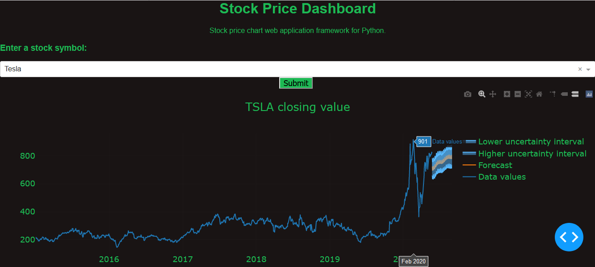

# stock-prediction-rnn-web-app
**Disclaimer:** I'm not a financial expert. This project is for educational and entertainment purposes only to demonstrate the application of TensorFlow/Keras, Dash and other visualisations.

Please consult a professional financial consultant for investing. Invest at your own risk.

## About
Project to predict stock prices with Recurrent Neural Network in TensorFlow/Keras, fbprophet (library by Facebook for forecasting time series data) with client input as web application (in Dash) for forecasting.

Feedback much appreciated and I hope you have fun running these dashboards! :)


<p align="center"><i>Image of Tesla (TSLA) stock price over time with forecast, lower and higher intervals.</i></p>

## Dependencies
Install the following libraries before running `stock_dash.py` and `stock_forecast.py`.
```
pandas
dash
fbprophet
yfinance
plotly
datetime
```
Dash is the main library to create the dashboard application, while yfinance and fbprophet are the dependencies to get historic stock prices and forecasting. Plotly needed for visualisations on the dashboard and pandas for storing and reading the price data. datetime for yfinance to get values up to 5 years from end date (end date default is latest trading date.)

## Updates and Usages
**05/22/2020**<br>
There are now two dash python files; `stock_dash.py` is the stock price, candlestick and volume dashboard. A new file, `stock_forecast.py` contains forecast of up to 100 days from latest trading date.

To run forecast dash app, run in terminal the following:
```
python stock_forecast.py
```
Then in the web browser address bar enter `localhost:8050`.

Select a company from the dropdown and hit submit. After a few seconds, the graph updates, containing the historic stock price data, the forecast values, upper bound interval and lower bound interval.

**04/14/2020**<br>
Explored Dash (Plotly) library to create simple dashboard to display candlestick graph of stock price up to a year. Includes open and close prices. Red indicates drop in price on the day, green indicates an increase in price.

To run the stock dashboard dash app, run in terminal the following:
```
python stock_dash.py
```
Then in the web browser address bar enter `localhost:8050` (where `8050` is the port number to run `stock_dash.py`.)
